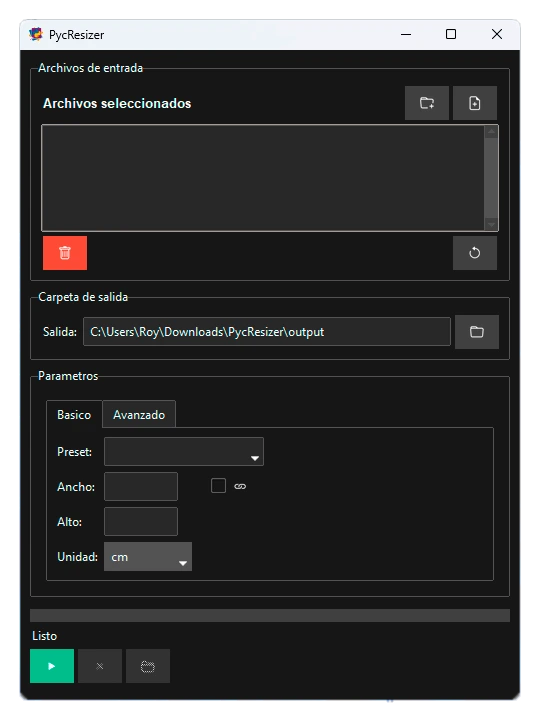
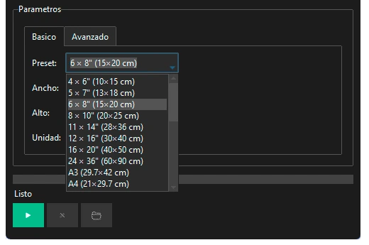
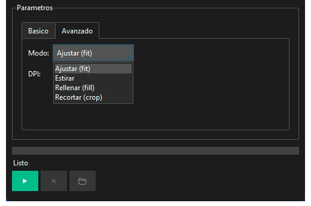

<p align="center">
  
</p>

<h1 align="center">PycResizer</h1>

<p align="center">
  <a href="https://www.python.org/">
    
  </a>
  <a href="https://pypi.org/project/Pillow/">
    
  </a>
  <a href="https://pypi.org/project/ttkbootstrap/">
    
  </a>
  <a href="LICENSE">
    
  </a>
  <a href="https://github.com/pyinstaller/pyinstaller">
    
  </a>
</p>

Procesador de imagenes por lotes con interfaz grafica. Redimensiona multiples imagenes simultaneamente con presets predefinidos y conversion de unidades.

## Caracteristicas

- Redimensionamiento por lotes de multiples imagenes
- 44 presets predefinidos (fotos, documentos, redes sociales, pantalla)
- 4 modos de redimensionamiento: FIT, STRETCH, FILL, CROP
- Conversion de unidades: px, cm, mm, pulgadas
- Interfaz con pestañas Basico y Avanzado
- Proceso paralelo con workers dinamicos
- Soporte para PNG, JPEG, BMP, TIFF, WEBP, GIF

## Requisitos Previos

- Python 3.10 o superior
- Windows (ejecutable portable)

## Instalacion

### Como aplicacion portable

Descarga el ejecutable `PycResizer.exe` desde la seccion Releases y ejecutalo directamente.

### Desde codigo fuente

```bash
# Clonar el repositorio
git clone https://github.com/tu-usuario/PycResizer.git
cd PycResizer

# Crear entorno virtual
python -m venv venv
venv\Scripts\activate

# Instalar dependencias
pip install -r requirements.txt

# Ejecutar aplicacion
python src/app.py
```

### Construir ejecutable

```bash
pip install pyinstaller
pyinstaller pycresizer.spec --clean
```

El ejecutable se generara en `dist/PycResizer.exe`.

## Uso

1. Selecciona imagenes individuales o una carpeta completa
2. Elige un preset o ingresa dimensiones manualmente
3. Selecciona el modo de redimensionamiento
4. Define la carpeta de salida
5. Haz clic en Iniciar

### Modos de redimensionamiento

| Modo | Descripcion |
|------|-------------|
| FIT | Ajusta la imagen manteniendo relacion aspecto |
| STRETCH | Estira a dimensiones exactas |
| FILL | Rellena con fondo blanco |
| CROP | Recorta desde el centro |

## Estructura

```
PycResizer/
├── assets/
│   ├── icon.ico          # Icono de ventana
│   ├── pyc.png          # Logo de aplicacion
│   ├── ui.webp          # Captura de interfaz
│   ├── preset.webp      # Captura de presets
│   └── modo.webp        # Captura de modos
├── src/
│   ├── app.py           # Punto de entrada
│   ├── core/
│   │   ├── batch_handler.py    # Procesamiento por lotes
│   │   ├── image_processor.py  # Procesador de imagenes
│   │   └── unit_converter.py    # Conversion de unidades
│   ├── gui/
│   │   ├── main_window.py       # Ventana principal
│   │   ├── components.py        # Componentes GUI
│   │   └── validators.py        # Validadores
│   └── utils/
│       ├── config.py      # Configuracion y presets
│       ├── icons.py       # Gestion de iconos
│       └── exceptions.py  # Excepciones personalizadas
├── tests/
│   ├── test_unit_conversion.py
│   ├── test_resize_modes.py
│   ├── test_crop_id_card.py
│   └── test_batch_performance.py
├── requirements.txt
├── pycresizer.spec
└── build.py
```

## Capturas de pantalla

### Interfaz principal

<p align="center">
  
</p>

### Presets disponibles

<p align="center">
  
</p>

### Modos de redimensionamiento

<p align="center">
  
</p>

## Licencia

MIT License - consulta el archivo LICENSE para mas detalles.
