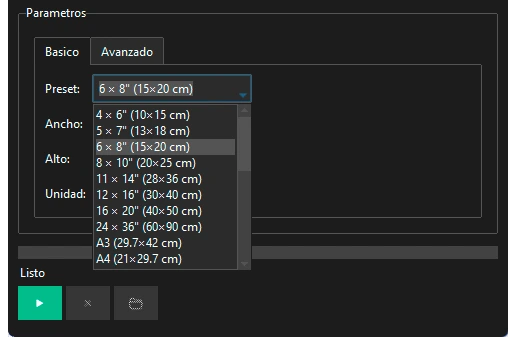

<p align="center">
  
</p>

<h1 align="center">PycResizer</h1>

<p align="center">
  <b>English Version</b> •
  <a href="README_ES.md">Versión en Español</a>
</p>

<p align="center">
  <a href="https://www.python.org/">
    
  </a>
  <a href="https://pypi.org/project/Pillow/">
    
  </a>
  <a href="https://pypi.org/project/ttkbootstrap/">
    
  </a>
  <a href="LICENSE">
    
  </a>
  <a href="https://github.com/pyinstaller/pyinstaller">
    
  </a>
</p>

Batch image processor with a graphical user interface. Resize multiple images simultaneously using built-in presets and unit conversion capabilities.

## Key Features

- Batch resizing of multiple images
- 44 built-in presets (Photos, Documents, Social Media, Display)
- 4 Resizing Modes: FIT, STRETCH, FILL, CROP
- Unit conversion: px, cm, mm, inches
- Tabbed interface (Basic and Advanced settings)
- Parallel processing with dynamic workers
- Support for PNG, JPEG, BMP, TIFF, WEBP, and GIF

## Prerequisites

- Python 3.10 or higher
- Windows (for portable executable)

## Installation

### As a Portable Application

Download the `PycResizer.exe` executable from the Releases section and run it directly.

### From Source Code

```bash
# Clone the repository
git clone https://github.com/tu-usuario/PycResizer.git
cd PycResizer

# Create virtual environment
python -m venv venv
venv\Scripts\activate

# Install dependencies
pip install -r requirements.txt

# Run application
python src/app.py
```

### Building the Executable

```bash
pip install pyinstaller
pyinstaller pycresizer.spec --clean
```

The executable will be generated in `dist/PycResizer.exe`.

## Usage

1. Select individual images or an entire folder.
2. Choose a preset or enter dimensions manually.
3. Select the desired resizing mode.
4. Define the output folder.
5. Click **Start**.

### Resizing Modes

| Mode | Description |
|------|-------------|
| FIT | Resizes the image while maintaining its aspect ratio. |
| STRETCH | Stretches the image to the exact dimensions specified. |
| FILL | Fills the target area, adding a background if necessary. |
| CROP | Resizes and crops the image from the center to fill the area. |

## Project Structure

```
PycResizer/
├── assets/                 # Visual assets and icons
├── src/
│   ├── app.py              # Application entry point
│   ├── core/               # Processing logic
│   │   ├── batch_handler.py
│   │   ├── image_processor.py
│   │   └── unit_converter.py
│   ├── gui/                # User interface components
│   │   ├── components.py
│   │   ├── main_window.py
│   │   ├── settings_window.py
│   │   └── validators.py
│   └── utils/              # Shared utilities
│       ├── config.py
│       ├── exceptions.py
│       ├── i18n.py
│       └── icons.py
├── tests/                  # Test suites
│   ├── test_batch_performance.py
│   ├── test_core_resilience.py
│   ├── test_crop_id_card.py
│   ├── test_presets_i18n.py
│   ├── test_resize_modes.py
│   └── test_unit_conversion.py
├── pycresizer.spec         # PyInstaller build specification
└── requirements.txt        # Project dependencies
```

## Screenshots

### Main Interface

<p align="center">
  
</p>

### Available Presets

<p align="center">
  
</p>

### Resizing Modes

<p align="center">
  
</p>

## License

MIT License - See the LICENSE file for more details.
