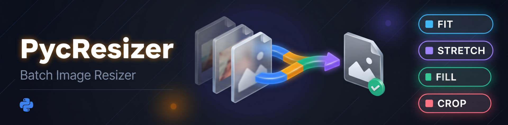
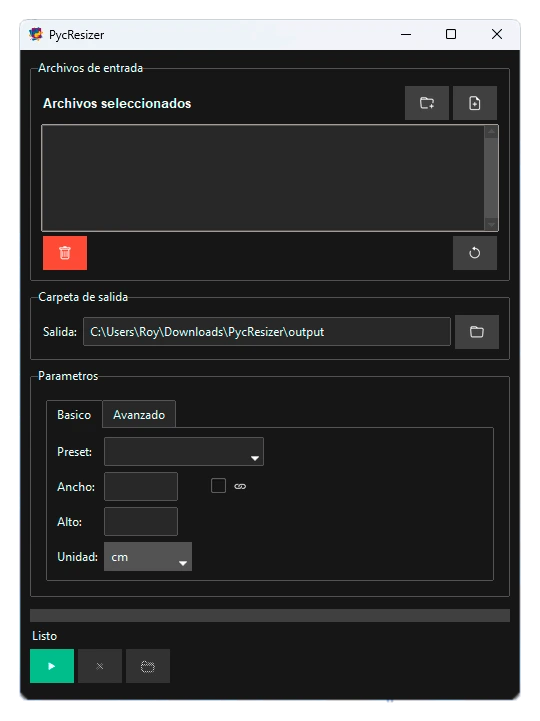
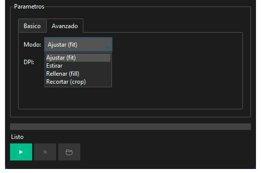

<p align="center">
  
</p>

<h1 align="center">PycResizer</h1>

<p align="center">
  <a href="https://www.python.org/">
    
  </a>
  <a href="https://python-pillow.github.io/">
    
  </a>
  <a href="https://github.com/israel-dryer/ttkbootstrap">
    
  </a>
  <a href="LICENSE">
    
  </a>
</p>

<p align="center">
  Desktop batch image resizing for photos, documents, social media assets, and display formats.
</p>

---

## Quick Start

```bash
git clone https://github.com/roymejia2217/PycResizer.git
cd PycResizer
python -m venv .venv
source .venv/bin/activate
python -m pip install --upgrade pip
python -m pip install -r requirements.txt
```

```bash
python src/app.py
```

---

## Features

| Feature | Description |
|---------|-------------|
| **Batch image selection** | Processes individual image files or folders selected from the graphical interface. |
| **Output folder selection** | Writes processed files to a user-selected output directory. |
| **Preset sizing** | Provides predefined sizes for photos, ISO paper, documents, ID cards, displays, video, and social media. |
| **Manual dimensions** | Accepts custom width and height values for one-off resizing work. |
| **Unit conversion** | Converts dimensions between pixels, centimeters, millimeters, and inches. |
| **DPI-aware output** | Applies the configured DPI when physical units are converted to pixels. |
| **Resize modes** | Supports fit, stretch, fill, and crop behaviors. |
| **Parallel processing** | Uses worker threads to process batches while reporting progress. |
| **Cancellation support** | Allows an active batch operation to be cancelled from the interface. |
| **Metadata preservation** | Preserves ICC profiles and EXIF metadata where Pillow and piexif can process them. |
| **Release automation** | Builds Windows and Linux artifacts from Git tags through GitHub Actions. |
| **Debian packaging** | Produces a `.deb` package with a desktop entry, icon, license file, and installed binary. |

---

## Prerequisites

| Dependency | Purpose | Installation |
|------------|---------|--------------|
| **Python** 3.10+ | Runs the source application and installs dependencies. | [Download Python](https://www.python.org/) |
| **Tkinter** | Provides the desktop GUI toolkit used by the application. | `sudo apt-get install python3-tk` |
| **pip** | Installs the pinned Python dependencies. | `python -m ensurepip --upgrade` |
| **dpkg-deb** (optional) | Builds Debian packages from the staged package tree. | `sudo apt-get install dpkg-dev` |

**Note:** Linux builds require a desktop session capable of displaying Tk windows.

---

## Installation

```bash
python -m venv .venv
source .venv/bin/activate
python -m pip install --upgrade pip
python -m pip install -r requirements.txt
```

On Windows, activate the virtual environment with:

```powershell
.venv\Scripts\Activate.ps1
```

---

## Usage

```bash
python src/app.py
```

1. Add image files or choose a folder from the input panel.
2. Select an output folder.
3. Choose a preset or enter custom dimensions.
4. Select a unit, DPI value, and resize mode.
5. Start the batch operation.

**Output naming:**
- Processed files use the `_resized` suffix by default.
- If the output path would overwrite the input file, the batch handler writes a `_pyc` file instead.

**Default output folder:**
- The initial output path is `~/Downloads/PycResizer/output`.

---

## Project Structure

```text
PycResizer/
├── .github/
│   └── workflows/
│       └── build-release.yml        # Builds tagged Windows, Linux, and Debian release artifacts
├── assets/
│   └── icon.ico                     # Runtime window icon bundled by PyInstaller
├── docs/
│   ├── banner.webp
│   ├── logo.png
│   └── screenshots/
│       ├── modo.webp
│       ├── preset.webp
│       └── ui.webp
├── packaging/
│   └── linux/
│       └── pycresizer.desktop       # Freedesktop launcher entry for Debian packages
├── scripts/
│   └── build_deb.sh                 # Stages and builds the Debian package
├── src/
│   ├── app.py
│   ├── core/
│   │   ├── batch_handler.py         # Batch execution, cancellation, and output validation
│   │   ├── image_processor.py       # Single-image resizing, metadata handling, and atomic writes
│   │   └── unit_converter.py        # Pixel and physical-unit conversion helpers
│   ├── gui/
│   │   ├── components.py
│   │   ├── main_window.py
│   │   ├── settings_window.py
│   │   └── validators.py
│   └── utils/
│       ├── config.py                # Presets, supported formats, and default output paths
│       ├── exceptions.py
│       ├── i18n.py                  # In-application translation registry
│       └── icons.py                 # PyInstaller-aware icon loading
├── tests/
│   ├── test_batch_performance.py
│   ├── test_core_resilience.py
│   ├── test_crop_id_card.py
│   ├── test_presets_i18n.py
│   ├── test_release_pipeline.py
│   ├── test_resize_modes.py
│   └── test_unit_conversion.py
├── LICENSE
├── pycresizer.spec                  # PyInstaller one-file build specification
├── README.md
└── requirements.txt
```

```text
# Runtime directories (created automatically):
~/Downloads/PycResizer/
└── output/
```

---

## Building Executables

```bash
python -m pip install -r requirements.txt
pyinstaller pycresizer.spec --clean --noconfirm
```

The PyInstaller output is written to `dist/`:

- Windows builds produce `dist/PycResizer.exe`.
- Linux builds produce `dist/PycResizer`.

After a Linux build, create the Debian package with:

```bash
scripts/build_deb.sh
```

The Debian package is written to `dist/packages/`.

Tagged releases are built by `.github/workflows/build-release.yml`. Pushing a tag such as `v1.3` starts the matrix workflow for Windows and Linux and publishes the generated release assets.

---

## Testing

```bash
python -m pip install -r requirements.txt
python -m pip install pytest
python -m pytest -q
```

Test coverage includes:

- `tests/test_core_resilience.py`: validates atomic writes, cancellation, collision handling, metadata retention, and output directory checks.
- `tests/test_crop_id_card.py`: validates crop behavior for ID-card-sized outputs.
- `tests/test_presets_i18n.py`: validates preset translation keys and language-aware preset lookup.
- `tests/test_release_pipeline.py`: validates README asset paths, workflow structure, Debian packaging inputs, and PyInstaller Tk image support.
- `tests/test_resize_modes.py`: validates fit, stretch, fill, and crop sizing behavior.
- `tests/test_unit_conversion.py`: validates pixel and physical-unit conversions.

---

## Credits

| Project | Description | License |
|---------|-------------|---------|
| [Pillow](https://python-pillow.github.io/) | Provides image loading, resizing, metadata access, and image output. | MIT-CMU |
| [piexif](https://github.com/hMatoba/Piexif) | Reads and writes EXIF metadata during image processing. | MIT |
| [ttkbootstrap](https://github.com/israel-dryer/ttkbootstrap) | Provides the themed Tkinter widgets used by the desktop interface. | MIT and Apache-2.0 or BSD-2-Clause |
| [ttkbootstrap-icons](https://github.com/israel-dryer/ttkbootstrap-icons) | Provides icon infrastructure for Tkinter and ttkbootstrap widgets. | MIT |
| [ttkbootstrap-icons-bs](https://github.com/israel-dryer/ttkbootstrap-icons) | Provides the Bootstrap icon provider used by the interface. | MIT |

---

## Screenshots

| Screenshot | Description |
|---|---|
|  | Main interface with input files, output path, presets, dimensions, and batch controls. |
|  | Preset selector with predefined output sizes. |
|  | Resize mode selector for fit, stretch, fill, and crop behavior. |

---

## License

MIT License. See [LICENSE](LICENSE) for details.
